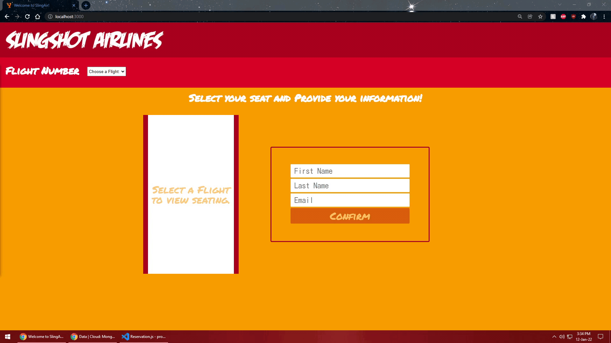
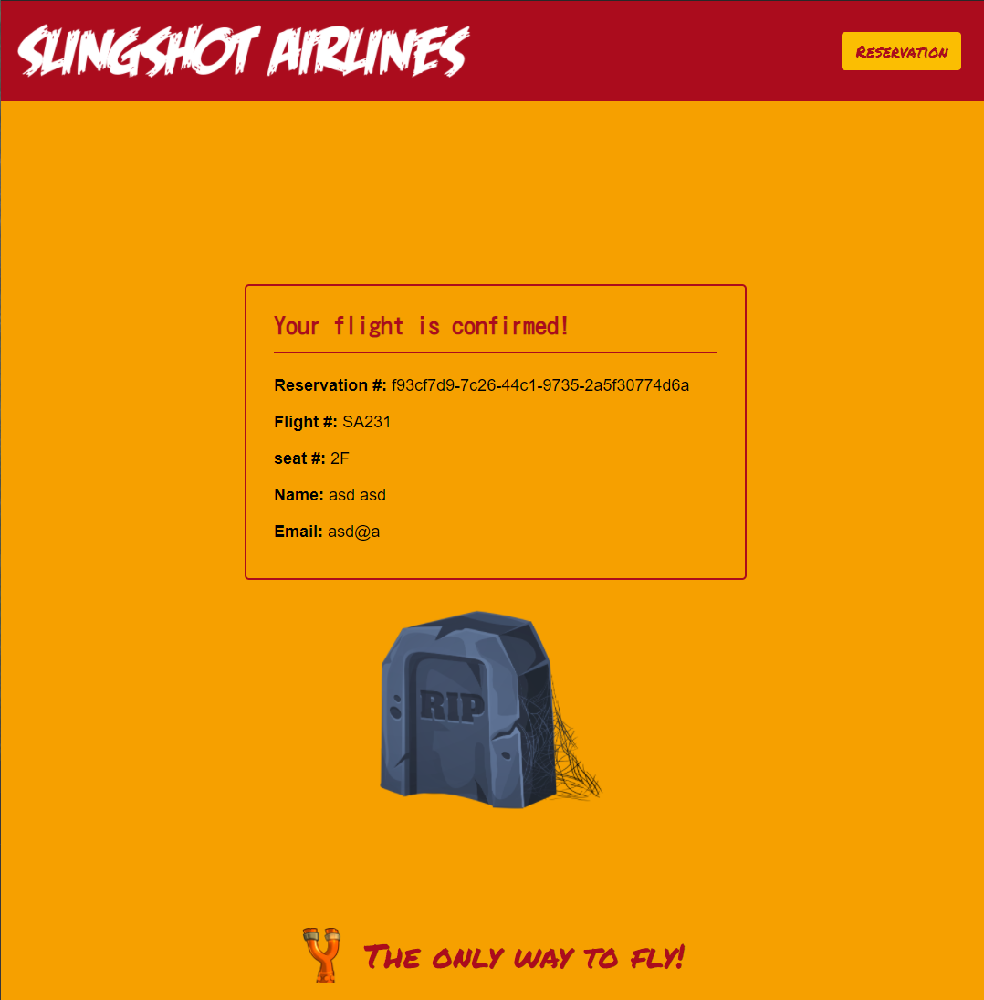
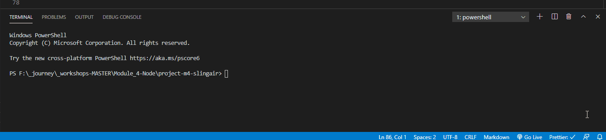

# SlingAir!


You just accepted the full-stack developer position at Slingshot Airlines!

They were really impressed with the work you did at Concordia Bootcamps. After a conversation with the CEO at the job fair, they hired you on the spot! They have project that they need to ship ASAP and are confident that you can deliver.

They have a new seat-booking app that is set to be released in 2 days! You were told that _most_ of the work is already done, and that all that remains is to connect the different pieces to get it working.

You have been provided with a GitHub repo and little else.

When you asked if it was possible to speak to the dev that worked on the project before you came aboard, you are told "Nope. Not possible. He left without notice and on bad terms."

Looks like you're on your own...

---

## The Expected App






### Functionality

- When a user navigates to `http://localhost:3000`, they are presented with a dropdown to select the flight number.
- With the flight number, make a request to the server for the seating availability on that flight.
- When a response with seating is received, display the seating input as well as the form requesting user's information.
- User selects a seat, enters information and clicks 'Confirm'.
- Contact the server with the data, and wait for a success response to redirect to the `/confirmation` page.
- The confirmation page should display a confirmation message to the user with the info that they entered on the previous screen.
- The reservation id is saved using `localStorage`. If the user closes and reopens the browser at `/reservation`, the information will still be `fetch`ed.

---

## Setup

### The Frontend

1. Open a terminal in VS Code
2. Type `cd frontend`
3. Type `yarn install`

Use `yarn dev:frontend` to start the frontend dev environment.

### The Backend

1. Open _another_ terminal in VS Code
2. Type `cd backend`
3. Type `yarn install`

Use `yarn dev:backend` to start the backend dev environment.



## Developer Notes

There is a folder called `notes` that contains possible hints on what to do next...

---

## Requirements for Project Completion

In order for your project to be considered `DONE` (passing grade), you should have a working MVP of the app.

This will require you to:

1. Create a `batchImport.js` file that correctly shapes the initial data and inserts it into MongoDB (see: Required structure).
2. Complete the handler functions.
3. Make sure your handler functions are shaping responses so the front end is operational.

---

### 1. Database Integration: MongoDB

Migrate the data in `backend/data.js` to a brand-new MongoDB database.

In order to incorporate the Database, you will need to setup your backend as it will not use the data in `data.js`, but will use the database to complete all of the requests it receives from the frontend.

The `reservations` collection is already structured for you. Just insert each element of the `reservations` array.

**Required structure:** (for `flights` collection)

```js
{
    _id: "SA231",
    flight: "SA231",
    seats: [{...}, {...}, {...}, ...]
}
```

---

### 2. Backend Handlers

1. Server endpoints are RESTful.

2. Server should respond in a _complete_ fashion:
  - Send the status and the `json` separately.
  - Send the status in the `json` object as well.
	- When a request fails, respond with the appropriate status code.
  - When a request succeeds respond with the requested data in the key of `data`.
  - When a request does not need any data to be returned, provide a message explaining the status: i.e. "reservation deleted."

```js
// example
res.status(200).json({ status: 200, data: theDataBeingRequested });

// or
res.status(200).json({ status: 200, message: "reservation deleted" });
```

3. There are endpoints for the following actions:

   - Retrieve all flight numbers.
     - Should respond with an array of the flight numbers.
   - Retrieve single flight data.
     - Should respond with an array of seating information.
   - Retrieve all reservations (not used by FE).
     - **_Must work through Insomnia._**
   - Retrieve a single reservation.
     - Should respond with a reservation object.
   - Create a reservation.
     - Needs to insert a document into the `reservations` collection.
     - Needs to modify a document in the `flights` collection.
     - Should respond with the \_id that was created.
   - Delete a reservation (not used by FE).
     - Needs to modify or delete a document in the `reservations` collection.
     - Needs to modify a document in the `flights` collection.
		 - **(don't forget to make the old seat available).**
     - **_Must work through Insomnia._**
   - Update a reservation (not used by FE).
     - Required: will modify the seat reserved on the same flight.
     - Optionally: will allow a change of flight.
     - Needs to modify a document in the `reservations` collection.
     - Needs to modify a document in the `flights` collection.
     - **(don't forget to make the old seat available).**
     - **_Must work through Insomnia._**

---

### 3. Frontend Verification

With your React environment running in a terminal, go to http://localhost:3000

You should be able to view the flights and make a reservation.

You should be able to view the reservation details after completing a reservation.

If you refresh the page after making the reservation, there should be a "reservation" link at the top right corner where you can see you reservation details.

If any functionality is not working, take a look at the console in the browser. It is likely you incorrectly shaped your response, or sent back the incorrect data.

You should not need to modify anything in the frontend, but feel free to add `console.log`s if you want to better test the contents of variables.

---

### Frontend

The frontend has already been completed. React will be covered after this project in detail, but feel free to look inside the `/frontend/src/service` folder to see which urls the frontend `fetch`s. You could further search the project for the use of those service functions, to see how their responses are handled.

Note: in the`client`'s `package.json`, you will find a `proxy` URL:

```json
    "proxy": "http://localhost:8000"
```

> This `proxy` will enable to front end to `fetch` to your server with a relative path.

These are functionalities that will be visible to you once the backend is completed

1. User can select a flight from a dropdown.
2. User can select an available seat.
3. User can enter their personal information.
4. User can view the flight confirmation page after booking a seat.
   - The confirmation page should `fetch` the details of the reservation from the backend based on it's unique `id`.
5. The reservation button in the header should only appear once a reservation has been made.
6. The reservation page should `fetch` the details of the most recent reservation from the backend based on it's unique `id`.

---

## Working as a team

- One student per team will fork.

- Everyone clones the fork.

- No one works on the master branch.

Use the [Group Project Step by Step Instructions](https://docs.google.com/document/d/1qb8He0EPejy3c32dv2XEhFZYvXFf0MUMArBNrK_40Zk/edit?usp=sharing)

---
